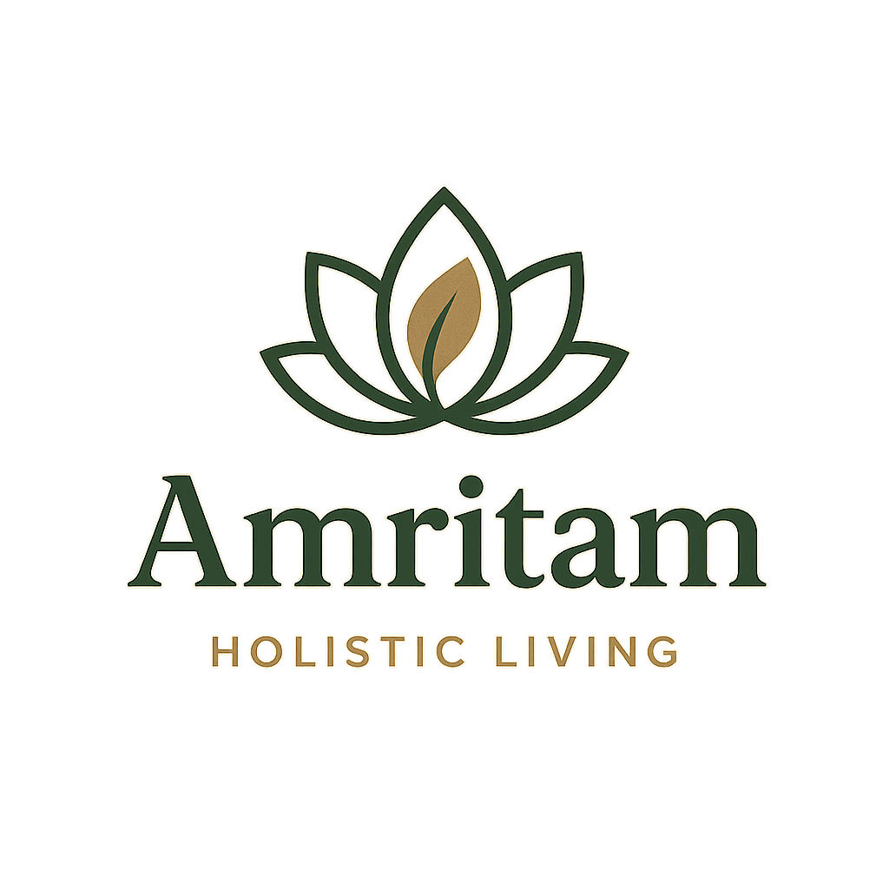

# Amritam - Holistic Wellness & Traditional Wisdom

A comprehensive React.js web application for Amritam, a brand dedicated to promoting holistic lifestyle through traditional Indian wisdom and modern wellness practices.



## 🌿 About Amritam

Amritam is more than just an online store—it's a complete ecosystem that combines:

- **Wellness programs and events** based on AYUSH (Ayurveda, Yoga, Unani, Siddha, Homeopathy)
- **Cultural preservation and promotion** using digital platforms to share traditional heritage
- **Authentic natural products** including medicinal herbs, essential oils, Ayurvedic supplements, and agri-based foods
- **Knowledge sharing** through heritage, wellness blogs, and educational content
- **Community building** through programs, workshops, and collaborations

### 🎯 Mission
To bridge ancient wisdom with modern living, creating accessible pathways to holistic wellness for everyone.

## 🚀 Features

### Core Pages
- **Home** - Landing page with hero section, featured products/services, and philosophy
- **About** - Company story, mission, values, and team information
- **Products** - Comprehensive product catalog with categories and filtering
- **Services** - Detailed service offerings with consultation booking
- **Contact** - Multi-channel contact options with form and FAQ
- **Blog** - Wellness articles and educational content
- **Events** - Workshops, retreats, and community events
- **Community** - Discussion forums, member profiles, and resource sharing

### Specialized Pages
- **Knowledge Base** - Comprehensive library of wellness articles and guides
- **Wellness Programs** - Structured programs for health transformation
- **User Dashboard** - Personalized user experience with order history and recommendations
- **Authentication** - Login and registration with social auth options

### Key Features
- **Responsive Design** - Mobile-first approach with Tailwind CSS
- **Modern UI/UX** - Clean, intuitive interface with smooth animations
- **Component-Based Architecture** - Reusable React components including Practitioners component
- **Routing** - Client-side routing with React Router
- **Search & Filtering** - Advanced product and content filtering
- **Interactive Elements** - Modals, tabs, and dynamic content
- **Accessibility** - WCAG compliant design patterns
- **SEO Friendly** - Semantic HTML and meta tags
- **Unique Image Management** - No duplicate images across services
- **Professional Team Showcase** - Reusable Practitioners component across multiple pages

## 🛠️ Tech Stack

- **Frontend**: React 18, React Router DOM 6
- **Styling**: Tailwind CSS with custom design system
- **Icons**: Material Symbols, Custom SVGs
- **Fonts**: Google Fonts (Lexend, Newsreader)
- **Build Tool**: Create React App
- **Package Manager**: npm

## 📦 Installation & Setup

### Prerequisites
- Node.js 16+ and npm
- Git

### Quick Start

1. **Clone the repository**
   ```bash
   git clone <repository-url>
   cd amritam
   ```

2. **Install dependencies**
   ```bash
   npm install
   ```

3. **Start the development server**
   ```bash
   npm start
   ```

4. **Open your browser**
   Navigate to `http://localhost:3000`

### Environment Setup
Create a `.env` file in the root directory (optional):
```env
REACT_APP_API_URL=your_api_endpoint
REACT_APP_ANALYTICS_ID=your_analytics_id
```

### Build for Production
```bash
npm run build
```
The optimized build will be in the `build/` folder.

### Deploy to GitHub Pages
```bash
npm run deploy
```
This will build and deploy your app to GitHub Pages automatically.

## 🚀 Deployment

### GitHub Pages Deployment

This project is configured for automatic deployment to GitHub Pages at: **https://amritamlife.github.io/**

#### Automatic Deployment
- Pushes to `main` or `master` branch trigger automatic deployment via GitHub Actions
- The site updates automatically within 2-5 minutes after pushing changes

#### Manual Deployment
To deploy manually:
```bash
npm run deploy
```

#### Setup Requirements
1. **Repository Settings**: Go to repository Settings → Pages
2. **Source**: Select "Deploy from a branch"
3. **Branch**: Select `gh-pages` branch
4. **Folder**: Select `/ (root)`

#### GitHub Actions Workflows
Two deployment workflows are available:
- `deploy.yml` - Uses official GitHub Pages action
- `deploy-gh-pages.yml` - Uses peaceiris/actions-gh-pages action

#### SPA Routing Support
- Includes 404.html for client-side routing support
- React Router works seamlessly with GitHub Pages
- Direct URL access to all routes is supported

## 🎨 Design System

### Color Palette
- **Primary**: Green shades (#66b319, #8ac348, etc.)
- **Surface**: Neutral earth tones (#fafbf8, #edf3e8, etc.)
- **Text**: Dark green (#141b0e)

### Typography
- **Headers**: Lexend (modern, clean)
- **Body**: Newsreader (readable serif for content)

### Components
- Consistent spacing and padding
- Rounded corners and soft shadows
- Hover states and smooth transitions
- Accessible color contrasts

## 📱 Responsive Breakpoints

- **Mobile**: < 768px
- **Tablet**: 768px - 1024px
- **Desktop**: > 1024px

## 🔧 Available Scripts

```bash
npm start          # Start development server
npm run build      # Build for production
npm test           # Run test suite
npm run eject      # Eject from Create React App
```

## 📂 Project Structure

```
src/
├── components/          # Reusable UI components
│   ├── Header.js       # Navigation header
│   ├── Footer.js       # Site footer
│   ├── Layout.js       # Main layout wrapper
│   ├── Logo.js         # Brand logo component
│   ├── Practitioners.js # Reusable team/practitioners showcase
│   ├── VineDecoration.js # Decorative vine animations
│   └── HeroSlider.js   # Hero section slider component
├── pages/              # Page components
│   ├── Home.js         # Landing page
│   ├── About.js        # About us page
│   ├── Products.js     # Product catalog
│   ├── Services.js     # Service listings
│   ├── Contact.js      # Contact page
│   ├── Blog.js         # Blog listing
│   ├── BlogPost.js     # Individual blog post
│   ├── Events.js       # Events and workshops
│   ├── Community.js    # Community features
│   ├── KnowledgeBase.js # Educational content
│   ├── WellnessPrograms.js # Wellness programs
│   ├── Dashboard.js    # User dashboard
│   ├── Login.js        # Login page
│   └── Register.js     # Registration page
├── App.js              # Main app component with routing
├── index.js            # App entry point
└── index.css           # Global styles and animations
public/
├── sample-images/      # Local image assets
│   ├── meal-plans-*.png     # Service meal plan images
│   ├── health-wellness-*.png # Health and wellness images
│   ├── heritage-*.png       # Traditional heritage images
│   ├── product-card-*.png   # Product showcase images
│   └── food-herbs-*.png     # Food and herbs images
├── logo.png           # Brand logo
└── index.html         # HTML template
```

## 🎯 Key Features by Page

### Home Page
- Animated hero section with call-to-action
- Featured products and services showcase
- Philosophy and mission statement
- Decorative vine animations
- Meet Our Practitioners section with professional team showcase

### Products Page
- Category-based filtering
- Product grid with hover effects
- Rating system and stock status
- Shopping cart integration ready

### Services Page
- Detailed service descriptions with unique images
- Modal popups with full information
- Booking integration ready
- Professional practitioner profiles with credentials and specialties
- Category-based service filtering

### About Page
- Company story and mission
- Team expertise showcase using reusable Practitioners component
- Values and commitments section
- Professional team member profiles

### Blog & Knowledge Base
- Article categorization and search
- Reading time estimates
- Related content suggestions
- Author profiles and social sharing

### Community Features
- Discussion forums
- Member profiles and contributions
- Resource sharing
- Event participation

### Wellness Programs
- Comprehensive program details
- Enrollment tracking
- Progress monitoring ready
- Success stories and testimonials

## 🔮 Future Enhancements

### Technical
- [ ] Add state management (Redux/Context API)
- [ ] Implement authentication backend
- [ ] Add payment gateway integration
- [ ] Set up content management system
- [ ] Add real-time chat support
- [ ] Implement push notifications
- [ ] Database integration for dynamic content
- [ ] Image optimization and CDN integration

### Features
- [ ] Advanced search with filters
- [ ] User reviews and ratings
- [ ] Wishlist functionality
- [ ] Order tracking system
- [ ] Subscription management
- [ ] Multi-language support
- [ ] Dark mode toggle
- [ ] Progressive Web App (PWA)

### Content
- [ ] Dosha assessment quiz
- [ ] Meal planning tools
- [ ] Meditation timer
- [ ] Progress tracking dashboard
- [ ] Integration with fitness apps
- [ ] Recipe calculator

## 🎨 Recent Updates

### ✅ Completed
- **Reusable Practitioners Component**: Created modular team showcase component
- **Image Optimization**: Removed duplicate images across all services
- **Component Architecture**: Improved code reusability and maintainability
- **Professional Team Showcase**: Enhanced practitioner profiles with credentials
- **Clean Repository**: Added comprehensive .gitignore file

### 🔧 Component Usage
```jsx
// Basic usage
<Practitioners />

// Custom title and subtitle
<Practitioners 
  title="Meet Our Experts"
  subtitle="Custom description text"
/>

// Without title section
<Practitioners showTitle={false} />
```

## 🤝 Contributing

1. Fork the repository
2. Create a feature branch (`git checkout -b feature/AmazingFeature`)
3. Commit your changes (`git commit -m 'Add some AmazingFeature'`)
4. Push to the branch (`git push origin feature/AmazingFeature`)
5. Open a Pull Request

### Development Guidelines
- Follow React best practices and hooks patterns
- Use Tailwind CSS for styling
- Ensure responsive design across all breakpoints
- Maintain accessibility standards
- Write descriptive commit messages

## 📄 License

This project is licensed under the MIT License - see the LICENSE file for details.

## 📞 Support

For support and questions:
- Email: info@amritam.com
- Phone: +1 (555) 123-4567
- Community: [Community Forums](http://localhost:3000/community)

## 🙏 Acknowledgments

- Traditional Ayurvedic wisdom and practices
- Modern web development community
- Open source libraries and tools
- Unsplash for placeholder images
- Google Fonts for typography

---

## 📊 Project Status

**Live URL**: [https://amritamlife.github.io/](https://amritamlife.github.io/)  
**Current Version**: 1.0.0  
**Status**: Active Development  
**Last Updated**: December 2024  

### 📈 Stats
- **Pages**: 12+ functional pages
- **Components**: 5+ reusable components
- **Images**: 20+ optimized local assets
- **Features**: Responsive design, SEO-ready, accessibility compliant
- **Deployment**: Automated GitHub Pages deployment

---

**Built with ❤️ for holistic wellness and traditional wisdom**  
*Amritam - Where Ancient Wisdom Meets Modern Wellness*
